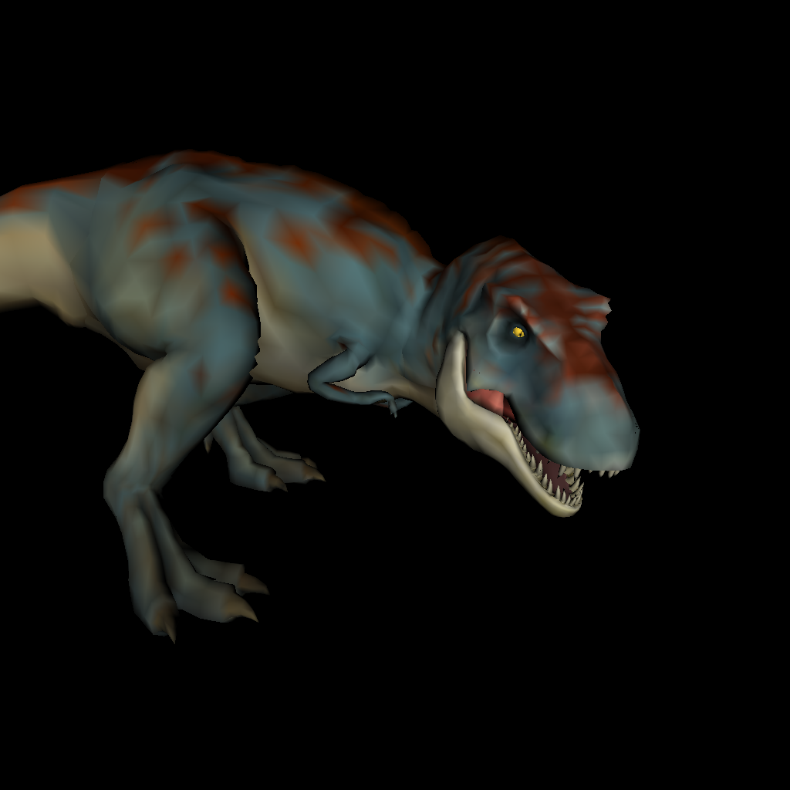

# Cython3DModelRenderer

This repo contains a Cython reimplementation of a university project in which a 3D model
renderer was implemented in pure Python using the Numpy library.

The project was done solely for education purposes: 3D graphics, Cython, unit testing. 
All the code is supplied with lots of commentaries regarding Cython code. 
You can use the code as a reference to help you understand Cython and the math behind 3D rendering.

## Project structure

This project consists of two parts: the original Python renderer (`py` package) and its Cython 
reimplementation (`cy`). Cython was used to optimize the `AdvancedPixelBufferFiller` class which does
mesh rendering, everything else remained unchanged.

There are three versions of the Cython renderer: A, B and C. I decided to save intermediate results
of code optimizations to see how different optimization approaches work.

See `run.py` script for an example of how to run the project.

## Renderer versions

The repository contains several versions of the same renderer that vary in their implementation and, therefore, performance:

Version A:
- This version mainly preserves the way all the computation is done in the Python-only implementation.
It has a 3x performance boost compared to Python-only implementation. 
The version is memory bounded (there is a lot of memory allocation going on) and it is very
hard to optimize it further without refactoring the memory management. 
So one of the conclusion we can draw regarding why some well-optimized numpy code may 
run not as fast as it could, is that the computation involves a lot of memory allocation.
Since allocating memory is a costly operation, it dampens the speed drastically. You have 
to use preallocated buffers for storing intermediate results. 

Version B:
- It is not much different from the version A in a sense of the way all the computations
are done. The main difference is that the buffers (normal, color, depth) are a part of the renderer
making the memory access much faster.

Version C (master):
- Differs drastically from the other two versions. The differences are:
  - does not perform rendering in a sequential manner triangle by triangle. All the triangles are projected first,
    then they are being drawn in a Cython loop;
  - no memory reallocation happens during rendering. All the computation results are
    saved into the buffers where the initial data is stored;
  - OpenMP is used to draw projected triangles in parallel.

## Performance

The tests were performed using the following hardware:
- CPU: Ryzen 7 4800H
- RAM: 16GB

For rendering `T-Rex.obj` was used. Rendering resolution was 1024x1024 pixels. No illumination
was used to exclude its effects on the measurements. Field of view (`fov`) was set to 45. Time
measurements were done using `%%time` magic in a Jupyter Notebook.

Before rendering the model underwent the following transformations:
```python
from crender.cy.data_structures import Model

def fit_model(m):
    m.shift(-m.get_mean_vertex())
    m.scale(1 / m.get_max_span())
    m.shift(shift=[0, 0, 1])
    
model = Model.read_model('objects/T-Rex.obj')
model.rotate([-90, 180, 0])
model.rotate([10, -80, 0])
fit_model(model)
```


| | Python | Version A | Version B | Version C (1 thread) | Version C (8 threads) | Version C (16 threads) |
| --- | --- | --- | --- | --- | --- | --- |
| Time | 2390 ms | 755 ms | 146 ms | 47 ms | 9 ms | 7 ms |
| Acceleration ratio | 1x | 3x | 16x | 51x | 265x | 341x |

## Rendering example


## Authors of the original Python renderer

- [oKatanaaa](https://github.com/oKatanaaa) - advanced rendering code (AdvancedPixelBufferFiller).
- [garrigar](https://github.com/garrigar) - data structures.
- [Banayaki](https://github.com/Banayaki) - data structures.
- [AlexRikka](https://github.com/AlexRikka) - basic rendering code and illumination.
